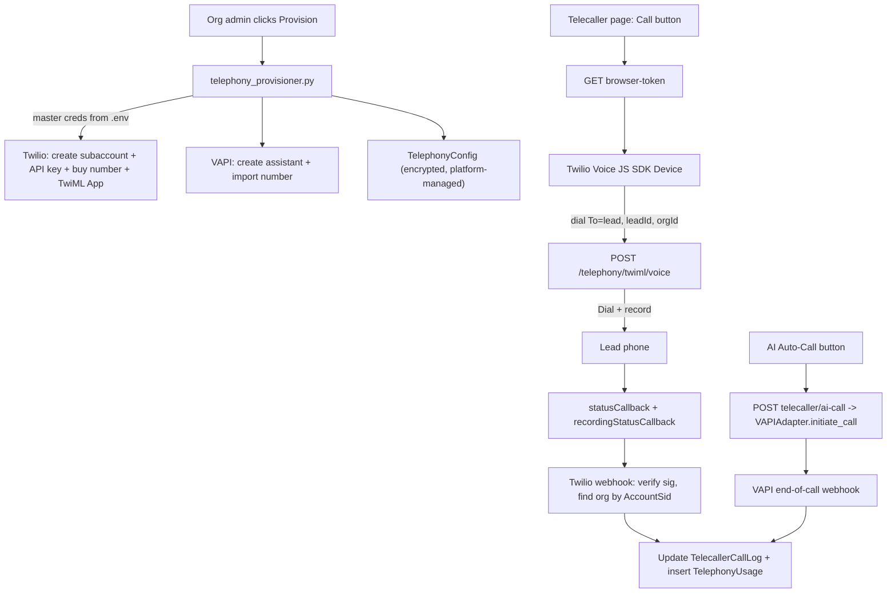

# Platform-Managed Telephony (Twilio + VAPI MVP)

## Goal
We (the platform) own master Twilio + VAPI accounts. Each org gets an auto-provisioned, isolated Twilio **subaccount** + phone number and a VAPI assistant/number. Users place **browser calls** and trigger **AI auto-calls** without ever pasting credentials. Every call is metered for billing.

## How it works end-to-end

## Key decisions baked in
- Credentials stored **encrypted** (Fernet, key derived from `secret_key`) since they are now OUR master/subaccount secrets, not user-pasted.
- Org isolation + metering via Twilio **subaccounts** (one per org). Webhooks route to the right org by `AccountSid` (Twilio) / `metadata.org_id` (VAPI).
- Billing in this scope = **usage ledger + monthly aggregate + UI surface**. Actual money collection (Stripe metered billing) is flagged as a follow-up phase because no Stripe code exists today.

---

## Phase 0 — Foundation

**Config** ([config.py](apps/api/loomrun_api/config.py)) — add master/platform settings:
- `twilio_master_account_sid`, `twilio_master_auth_token`, `twilio_master_api_key_sid`, `twilio_master_api_key_secret`
- `vapi_master_api_key`
- `telephony_markup_multiplier: float = 1.5` (billed = provider cost x markup), or per-min rate by plan
- reuse `public_api_url` for webhook + TwiML URLs

**Encryption** — new `apps/api/loomrun_api/telephony/crypto.py`: `encrypt_credentials(dict)->str` / `decrypt_credentials(str)->dict` using `cryptography.fernet` with a key derived from `settings.secret_key`. Used everywhere credentials are read/written.

**Schema** ([schema.prisma](prisma/schema.prisma)) + migration:
- `TelephonyConfig`: add `provisioned Boolean @default(false)`, `phoneNumber String?`, `subaccountSid String?`, `externalRefs Json?` (twiml_app_sid, api_key_sid, vapi assistant/number ids). Keep `credentials Json?` but now store the encrypted blob.
- New `TelephonyUsage` model: `id, organizationId, callLogId?, provider, direction, callSid, durationSeconds, providerCost Decimal, billedCost Decimal, createdAt` + indexes on `(organizationId, createdAt)`. Add relation on `Organization`.
- `TelecallerCallLog` already has `callSid, recordingUrl, transcriptRaw, aiSummary, durationSeconds, callSource` — reuse as-is.

## Phase 1 — Per-org provisioning

New `apps/api/loomrun_api/telephony/provisioner.py` (mirrors [n8n_provisioner.py](apps/api/loomrun_api/n8n_provisioner.py)):
- `provision_twilio(org)`: create subaccount -> create API Key/Secret on subaccount -> create TwiML App (Voice URL = `{public_api_url}/v1/telephony/twiml/voice`) -> buy a phone number (search available, `incoming_phone_numbers.create`) with voice URL set. Persist all ids (encrypted) into `TelephonyConfig` (provider `TWILIO`, `provisioned=true`, `isActive=true`).
- `provision_vapi(org)`: create assistant (default prompt + org name) -> import/buy number via VAPI API -> persist `assistant_id`, `phone_number_id`.
- `teardown_*` for offboarding/suspend.

New endpoints in [telephony.py](apps/api/loomrun_api/routers/telephony.py) (admin-only via `require_roles`):
- `POST /orgs/{org_id}/telephony/provision` (body: `{provider}` or "all") -> runs provisioner.
- Rework `GET .../providers` to return provisioning status, assigned number, and current-month usage instead of credential-entry fields.

## Phase 2 — Human browser dialer (Twilio)

**Backend**
- Fix `TwilioAdapter.get_browser_token` ([twilio.py](apps/api/loomrun_api/telephony/adapters/voice/twilio.py)): use real `AccessToken(account_sid, api_key_sid, api_key_secret, identity=...)` with a `VoiceGrant(outgoing_application_sid=twiml_app_sid, incoming_allow=True)`. Current call signature is incorrect and must change.
- New `POST /v1/telephony/twiml/voice` (no auth, Twilio-signature-verified): reads `To`, `leadId`, `orgId` params, returns `<Dial record="record-from-answer-dual" recordingStatusCallback=... statusCallback=...>{lead number}</Dial>` using the org's caller-ID number.
- `POST /orgs/{org_id}/telecaller/calls` extended (or new `prepare-call`) to pre-create a `TelecallerCallLog` (callSource=HUMAN, outcome pending) and return params so the webhook can map `callSid -> leadId`.

**Frontend** ([TelecallerPage.tsx](apps/web/src/pages/TelecallerPage.tsx))
- Add `@twilio/voice-sdk`. Add a **Call** button next to the lead: fetch `browser-token`, init `Device`, `device.connect({ params: { To, leadId, orgId } })`.
- In-call UI: timer, mute, hang up. On disconnect, auto-open the existing Log Call form pre-filled with measured duration.

## Phase 3 — AI auto-call (VAPI)

- New `POST /orgs/{org_id}/telecaller/ai-call` (body `{lead_id}`): resolve active AI adapter via [resolver.py](apps/api/loomrun_api/telephony/resolver.py), call `initiate_call(lead_phone, lead_name, metadata={org_id, lead_id})`, create `TelecallerCallLog` (callSource=AI, callSid=vapi id, outcome pending).
- Frontend: **AI Auto-Call** button on the telecaller page (and optional one-click fallback when a human call returns NO_ANSWER/BUSY).

## Phase 4 — Webhooks (fully implemented)

- Implement `TwilioAdapter.parse_webhook` and `VAPIAdapter.parse_webhook` for real payloads.
- `twilio_webhook` in [telephony.py](apps/api/loomrun_api/routers/telephony.py): verify `X-Twilio-Signature`, find org by subaccount `AccountSid`, find call log by `CallSid`, update `recordingUrl`/`durationSeconds`/outcome, insert `TelephonyUsage` (providerCost from `Price`, billedCost = cost x markup).
- `vapi_webhook`: verify shared secret, parse `end-of-call-report` (transcript, summary, cost, duration), update the AI `TelecallerCallLog`, insert `TelephonyUsage`.
- Other 6 provider webhook stubs remain as-is (out of MVP scope).

## Phase 5 — Usage metering + billing surface

- `GET /orgs/{org_id}/telephony/usage?month=` -> aggregates `TelephonyUsage` (minutes, provider cost, billed cost, by provider/direction).
- Rework [TelephonyPage.tsx](apps/web/src/pages/TelephonyPage.tsx) from "paste credentials" into a managed dashboard: provisioning status, assigned number(s), current-month minutes + cost, and a Provision button. Remove the credential modal for managed providers.
- **Follow-up (flagged, not built now):** report metered usage to Stripe (`Subscription`/`stripeCustomerId` already in schema) or prepaid credits wallet. Needs adding the `stripe` dependency and a billing router.

## Phase 6 — Security & ops
- Encrypt all stored credentials (Phase 0 crypto) and never return secrets to the client.
- Twilio signature + VAPI secret verification on all webhooks.
- Provisioning/teardown gated to org OWNER/ADMIN; master creds only in server `.env`.
- Teardown hook on org suspend/delete to release Twilio numbers/subaccounts (avoid ongoing charges).

## Out of scope (this build)
- Plivo, Exotel, Telnyx, Vonage, Retell, Bland adapters remain stubs.
- Live Stripe metered charging (schema-ready, flagged as Phase 5 follow-up).
- Real-time call transcription for human Twilio calls (recording is captured; transcription can be a later add via Twilio/OpenAI).