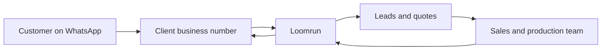
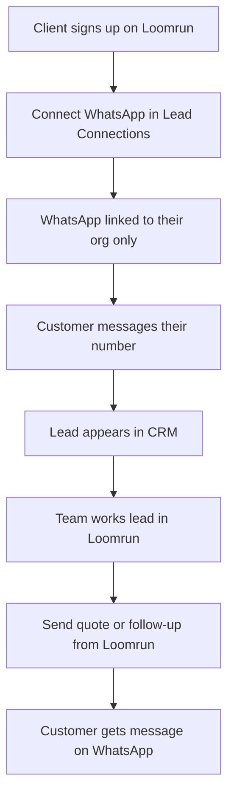

# WhatsApp as a Service for Loomrun Clients

## What you are selling

Loomrun already treats WhatsApp as a **lead source** and a **way to reach customers** (follow-ups, quotes, order updates). The service you offer clients is:

> **“Your factory’s WhatsApp talks to Loomrun — new enquiries become leads, and your team can reply and send quotes without losing track.”**

That fits manufacturing clients who already live on WhatsApp with buyers.

---

## The three big choices (and tradeoffs)

### Choice 1: Who owns the WhatsApp number?

| Option | What it means | Good | Bad |
|--------|---------------|------|-----|
| **A. Client brings their own number** | Client keeps their existing business WhatsApp; they connect it to Loomrun once | Clients trust it — same number customers already know; they own the account if they leave | Setup takes longer; you need a clear “connect in 15 minutes” guide or onboarding call |
| **B. Loomrun gives each client a number** | You create and run a WhatsApp number per client | Faster start; you control quality | Clients may not want a “new” number; you carry cost and Meta rules; messy if they cancel |
| **C. Offer both** | Default = own number; optional “we set you up” for a fee | Flexibility | More support and two flows to maintain |

**Recommendation:** **A as default, C for premium onboarding.** Manufacturing buyers already know the factory’s number — changing it hurts trust.

---

### Choice 2: How deep is the product on day one?

| Level | What clients get | Good | Bad |
|-------|------------------|------|-----|
| **Leads only** | Incoming WhatsApp creates a lead; team still chats on phone | Fastest to launch | Half a solution — data still splits between phone and Loomrun |
| **Leads + outbound** | Capture leads + send quotes and templates from Loomrun | Matches how you already built quotes and follow-up templates | Team may still check phones for replies |
| **Full inbox** | All messages in Loomrun; team replies there | One place for sales; best long-term product | More build and training; clients expect fast replies |

**Recommendation:** Ship **Leads + outbound** first (capture + send quotes/follow-ups), then add **full inbox** as the upgrade. Your platform already has the bones for capture and sending — sending just needs to actually work end-to-end.

---

### Choice 3: Talk to WhatsApp directly or through a partner?

| Option | Plain meaning | Good | Bad |
|--------|---------------|------|-----|
| **Direct (Meta / WhatsApp Business)** | Loomrun plugs into WhatsApp’s official business tools | Lower per-message cost at scale; you already started this path | You handle setup help and Meta’s rules |
| **Through a middleman (e.g. Twilio-style provider)** | Another company sits between you and WhatsApp | Easier billing and support in some cases | Extra cost per message; another vendor |

**Recommendation:** **Stay direct with WhatsApp Business** for Loomrun — you already receive messages that way, and it keeps margins healthy for a SaaS product. Revisit a partner only if clients demand it or Meta setup becomes a blocker.

---

## How to package it for clients

Think in **three tiers** clients can understand:

1. **Included (Free / base plan)**  
   - Connect WhatsApp  
   - Incoming messages create leads  
   - See WhatsApp as a lead source on the dashboard  

2. **Growth (paid add-on or mid tier)**  
   - Send follow-ups and quote notifications from Loomrun  
   - Message templates (follow-up, order ready, reorder — you already have these in the product)  
   - Message history tied to each lead  

3. **Pro (higher tier or setup fee)**  
   - Full two-way inbox inside Loomrun  
   - Loomrun helps connect their WhatsApp (white-glove onboarding)  
   - Optional: automated reminders (e.g. quote not answered in 3 days)  

**Pricing ideas (simple):**
- **Setup fee** for “we connect your WhatsApp for you” (one-time)  
- **Monthly add-on** for sending + inbox (not per message at first — easier to sell)  
- Later: **usage cap** (e.g. X outbound messages/month) if costs grow  

---

## What clients experience (client journey)

**What you must make obvious in the product:**
- A **“Connect WhatsApp”** step in Lead Connections (you already show this — it needs to feel trustworthy and step-by-step)  
- A **webhook URL** they paste once (or you do it for them on Pro)  
- Clear **“messages are sending / failed”** status so they trust it  
- **Privacy:** their chats and numbers stay inside their org only (multi-tenant — already how Loomrun works)  

---

## Rollout in four phases (simple order)

### Phase 1 — Make it real (must-have before selling)
- Outbound messages actually reach customers (today they are queued but not truly sent)  
- Each client uses **their own** WhatsApp connection, not one shared platform account  
- Basic “connected / not connected / message sent / failed” status  

**Outcome:** You can honestly say “WhatsApp works on Loomrun.”

### Phase 2 — Sell the core loop
- Lead from WhatsApp → assign → quote → send quote link/message on WhatsApp  
- Templates for common factory messages  
- Activity on the lead shows WhatsApp touchpoints  

**Outcome:** Clients see ROI: fewer lost enquiries, quotes sent from one place.

### Phase 3 — Full inbox (differentiator)
- See incoming and outgoing threads per lead in Loomrun  
- Sales replies without switching to phone  
- Optional: notify assignee when a lead replies  

**Outcome:** Loomrun becomes the daily WhatsApp workspace for the sales team.

### Phase 4 — Scale the service
- Self-serve setup guide + short video  
- Optional paid onboarding for Pro  
- Usage limits and billing tied to plan  
- Rules: who can send, approved templates (WhatsApp requires templates for many outbound messages after 24 hours)  

**Outcome:** You can onboard many clients without hand-holding every one.

---

## Risks to plan for (non-technical)

| Risk | What to do |
|------|------------|
| Client finds setup confusing | Offer “we set it up” on Pro; checklist + 10-minute call on Growth |
| WhatsApp limits marketing spam | Sell **service messages** (quotes, order updates) not bulk marketing; use templates |
| Team ignores Loomrun and uses phone | Full inbox + “reply from here” training; show managers activity in CEO dashboard |
| Client leaves Loomrun | Their number stays theirs (own-number model); they only disconnect the link |
| Support load | Start with 5–10 pilot factories; document every setup question before wide launch |

---

## Recommended path for Loomrun

1. **Service model:** Each client connects **their own** WhatsApp Business number; optional white-glove setup for paying clients.  
2. **Product scope:** **Phase 1 + 2 first** (working send/receive + leads + quotes/follow-ups), then inbox.  
3. **Go-to-market:** Pilot with **3–5 existing or friendly factories**; charge nothing until send works reliably, then add a **monthly WhatsApp add-on**.  
4. **Positioning:** *“Stop losing WhatsApp enquiries. Every message becomes a lead; send quotes without leaving Loomrun.”*  

This matches your platform today (multi-tenant, leads, quotations, WhatsApp page, Lead Connections) and avoids the trap of selling a feature that does not fully deliver yet.

---

## Success looks like

- Client connects WhatsApp in one session (or one onboarding call)  
- New WhatsApp enquiries show as leads within minutes  
- Sales sends at least one quote or follow-up from Loomrun per week  
- Client renews because WhatsApp activity is visible on leads and the CEO dashboard  
- You can onboard the next client without custom engineering  
